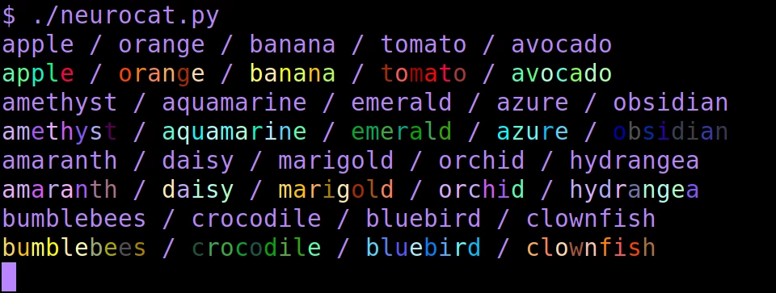
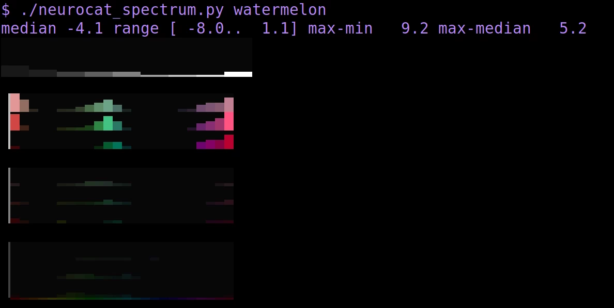
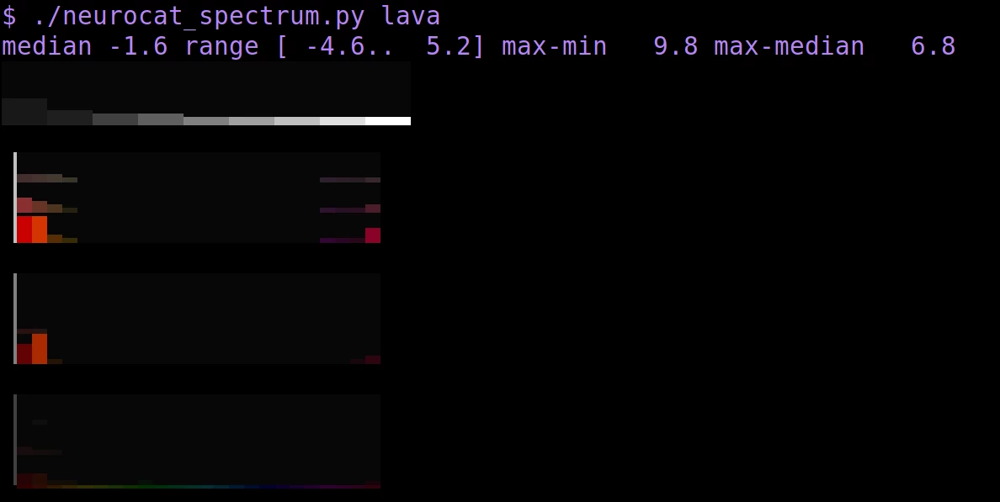
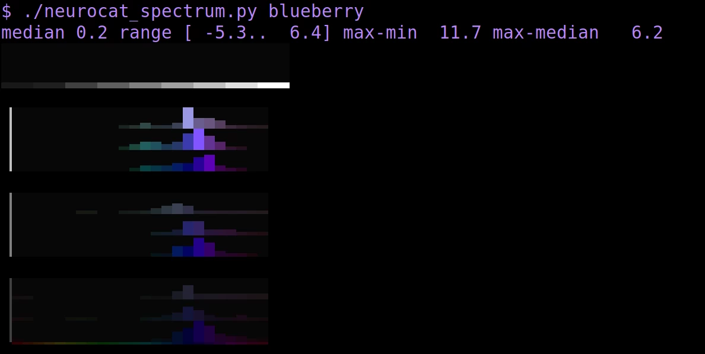

# neurocat



`neurocat` is an utility similar to `lolcat` for coloring text in the terminal. The twist is that it uses the CLIP model (a neural network trained on image-text pairs) associations to generate a color scheme for words. Artificial synesthesia, if you will.

There's some resemblance to the text effects of some old MUDs, except fully automatic!

As far as I'm aware this is the world's first text-to-colored-text model 😊.

## Dependencies

- A terminal supporting true color (pretty much any, these days).
- `numpy`

To generate the word database, `pytorch` (preferably with GPU, but if you're patient it can work on CPU) and Huggingface's `transformers` are required. After generating the word database these aren't necessary anymore.

## How does it work?

In a preparation step, images consisting entirely of solid colors were presented to the CLIP vision network. The resulting image embeddings (768-float vectors) were stored. While processing, every word in the input is fed through the CLIP text network, and the result is ranked by cosine similarity to every color. The colors are printed in order from closest association to most distant association. As words tend to be short, the result is that the word is printed in its most closely associated colors.

The program uses the ViT-L/14 CLIP model, but it would likely work with other versions of the model as well. I haven't tried.

Not all words have a strong association to specific colors. Often, you'll see the cliche red/teal color scheme, or random colors all over the place.

## Building the word database

Running the CLIP model for every encountered word would be ludicrously inefficient. For this reason, the program uses a database of stored text embeddings.

By default, `neurocat_build_worddb.py` will initialize its database from all valid words in `/usr/share/dict/words`. Note: this may take a while.

To insert words from another file:

    ./neurocat_build_worddb.py /path/to/words

Manually adding words:

    echo "pufferfish" | ./neurocat_build_worddb.py -

I don't know if it works for other languages than English. As CLIP is primarily trained on English-language captions it may not work that well. But you're welcome to try.

## Utilities

### `neurocat.py`

Print a text file in CLIP neural association colors.

Usage:

```
./neurocat.py [/path/to/text.txt]
```

Or with a pager:

```
./neurocat.py /path/to/text.txt | less -R
```

### `neurocat_spectrum.py`





Print a 'CLIP neural spectrum' for a word. This more closely analyzes the CLIP model's color assocations for a word.

Usage:

```
./neurocat_spectrum.py amethyst
```

## Further ideas

Instead of the word level, it's also possible to do this on the token level by using the output of the first hidden layer instead of CLIP's final output. To go even further, with multiple words at a time it's possible to show inter-word associations e.g. then "blue butterfly" shows both words in blue-ish, and "yellow butterfly" both words in yellow. The problem is that it's not as amendable to memorization that way, and requires a lot more resources. So I haven't added it here.

## Etcetera

This software doesn't come with any promise of usefulness of any kind. It's for amusement only. The output reflects the biases of the underlying model (and in turn, that of its training set), not those of the author.
